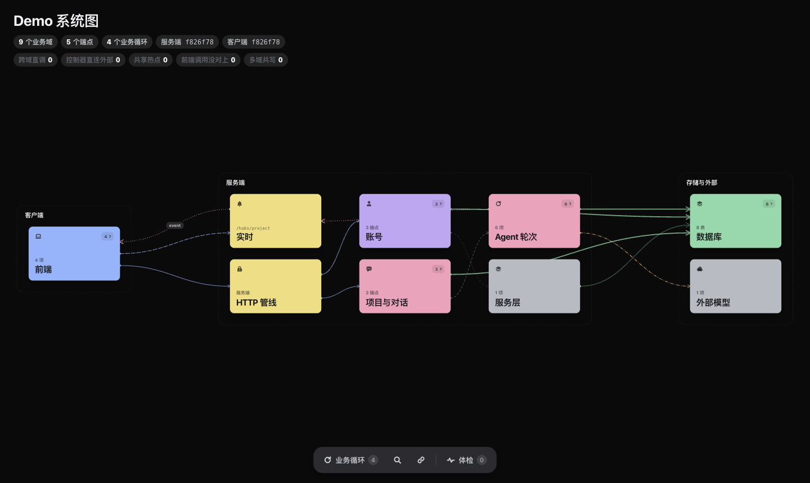
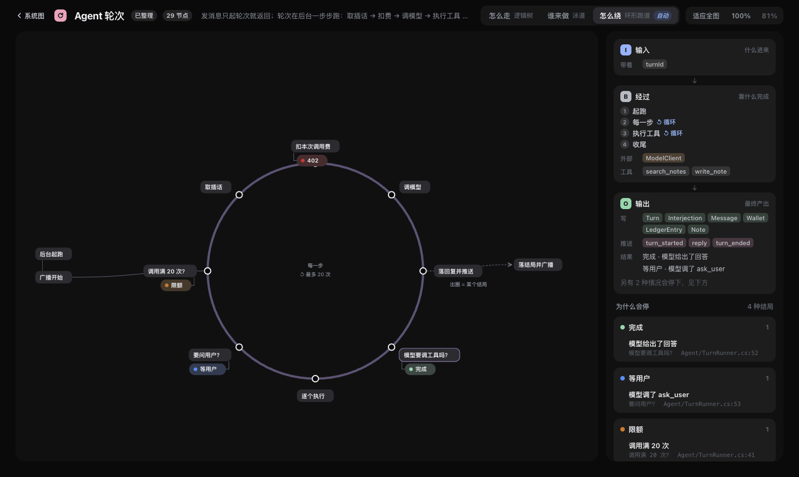

# backend-atlas —— 从真代码抽出整套系统图

把一个 **ASP.NET Core 服务端 + Vue/TS 客户端**（可带 Tauri Rust）的真实代码抽成一张自包含 HTML：
谁调谁、哪个按钮最终写了哪张表、推送谁收，以及每条业务循环**到底怎么跑**——哪里循环、哪里分岔、什么条件下停、停成什么结局。

事实全由抽取器给（Roslyn / TS 编译器 API / tree-sitter，零 LLM），人只写一份**语义层**（域怎么分、叫什么）。跨端连接只靠确定性对接：路由模板、Hub 事件名、Tauri 命令名。图不猜。



点一张卡开抽屉，「业务逻辑怎么跑」直达流程页。下图是示例项目的 Agent 轮次：按流程形态自动选画法（有回环 → 环形跑道），右栏是 IBO（输入 → 经过 → 输出）和「为什么会停」。



## 快速开始

需要 .NET 10 SDK 和 [bun](https://bun.sh)。仓库自带一个示例项目（注册、发消息、agent 循环、SignalR 推送、Tauri 桌面快发），clone 下来直接能跑：

```bash
cd skills/backend-atlas            # 用 npx skills add 装的：cd ~/.claude/skills/backend-atlas
SEM=examples/demo/atlas.json ./run.sh examples/demo/server/Demo.csproj examples/demo/client out/demo-atlas.html
open out/demo-atlas.html           # Linux：xdg-open
```

首次会装依赖、编译抽取器、还原示例的 NuGet 包（全新目录实测约 10 秒，第一次下载 NuGet 包另算）；之后按输入内容哈希增量，只改语义层时整趟约 0.2 秒。

作为 agent skill 使用时（`npx skills add ooooxo/ooooxoskill@backend-atlas`），对 agent 说「画一下这个系统」「这个按钮最后写了哪张表」「这个循环怎么跑」即可，agent 读 `SKILL.md` 自己跑。

## 接你自己的项目

```bash
SEM=~/code/shop/atlas.json ./run.sh ~/code/shop/server/Shop.Api/Shop.Api.csproj ~/code/shop/web out/shop-atlas.html
```

1. `atlas.json`（语义层）不存在就按抽取结果**自动生成骨架**再出图：每个控制器一个域、全部业务循环的键。放在你自己的项目仓库里，别放进 skill 目录。
2. 改成人话：域名、把相关控制器合并进一个域、给循环起名字写一句故事，重跑。build 报「语义层没认领这些节点」就按报错补。服务文件按「谁在用」自动归位，不用手分。
3. 看体检里「前端调用没对上」：有东西要么是外部服务，要么是写法没被认出来（对照下面的支持范围）。
4. 想看某条流程怎么跑：build 会给每个入口出草稿；关键的几条让 agent 整理进语义层 `flows`，每个节点引用代码锚点，代码改了锚点对不上 build 直接报错。

服务端给 `.csproj`（连同它引用的项目）或整个 `.sln` / `.slnx`；没有客户端写 `-`；发给别人看用 `SHARE=1`（HTML 里不带本机路径）。

细节见 [docs/porting.md](docs/porting.md) · [docs/flows.md](docs/flows.md)。

## 图上有什么

- **泳道 → 域 → 功能组 → 叶**：客户端 / 服务端 / 存储三道，点开逐层下钻；悬停聚焦一跳，点亮业务循环看整条链路。
- **体检**：跨域直调、控制器直连外部、共享热点、多域共写——全是确定性规则，点一项画布只亮涉及的卡。
- **流程页**：逻辑树 / 泳道 / 环形跑道三种画法，结局倒推，节点 ⌘ 点开源码。
- **意图画布**（`bun viewer/serve.ts`）：反方向——先在画布上画想要的结构，实现后虚线自动变实线。见 [docs/intent.md](docs/intent.md)。

## 支持范围与限制

- 服务端：ASP.NET Core 控制器（含基类上的路由 / 鉴权、泛型基类的动作）与 Minimal API（含 `MapGroup`）· SignalR（含 `Hub<T>`）· HostedService · EF Core · HttpClient · MediatR · 多项目解决方案 · Program.cs 或 Startup。必须能编译，有编译错直接退出。
- 客户端：Vue 3（`<script setup>` 与 Options API）· TypeScript / JavaScript · fetch · axios（含 `baseURL` 实例）· 自己包的请求函数（自动推断路径和动词）· SignalR JS 客户端 · Pinia · create-vue 的 tsconfig 与 `@/` 别名；有 `src-tauri` 就补 Rust 腿（tree-sitter 解析，不需要 Rust 工具链）。不装 `node_modules` 也能跑。
- 推送的事件信封：服务端 `SendAsync("event", { type, … })` 一个事件名装多种类型、前端按 `e.type` 分支的写法，按类型逐条对接到真正发起推送的服务和接收它的前端代码。
- 不支持：常规路由（`MapControllerRoute`）、Razor Pages、React / Svelte / Angular 客户端、Go / Node / Java 服务端（新写一条抽取腿，输出同构的 graph.json 即可）、Windows 原生（用 WSL）。完整对照表见 [docs/porting.md](docs/porting.md)。
- 静态分析的天然边界：运行时拼出来的 URL、反射调用、原生 SQL / Dapper 写表、泛型仓储 `Set<T>()` 的实体看不见；外部 HTTP 目标地址多在配置里，统一收成一张「出站 HTTP」卡。
- 系统要求：macOS / Linux（bash）、.NET 10 SDK、bun。不在 git 仓库里也能跑。
- 隐私：HTML 里带着代码派生的文字（错误原话、字符串常量、注释），代码里有不该外传的字面量就别把图发出去；意图画布只监听本机。

## 开发

```bash
bun test/examples.ts           # 回归：两个示例项目整趟跑——快照逐项对账 + 人工标注的事实逐条核对 + 意图画布冒烟
UPDATE=1 bun test/examples.ts  # 有意改动时重写快照，随改动一起提交（must.json 是人工标注，不会被改）
```

目录：`extractor/`（Roslyn 抽取）· `client/`（TS / Rust 抽取）· `join.ts`（两端拼接）· `viewer/`（出图模板与画法）· `examples/`（示例项目：demo 是自家写法，tutorial 是官方教程 / 分层项目写法，各带 `atlas.json` 语义层）· `docs/lab/`（画法对照页）。
